# B样条曲面插值与拟合
## 编程环境
### 开发环境
- 操作系统：win10
- IDE：Visual Studio 2019
- c++标准：c++17
### 第三方库
- glm : c++的一个数学库，主要提供向量和矩阵的操作。和OpenGL兼容比较好。本项目主要使用这个库的向量类。
- Eigen : c++的一个线性代数库，提供多种向量和矩阵的操作，比glm多了一些线性方程求解算法。本项目主要用这个库来解线性方程。
- glad : OpenGL函数的查询和加载库，与GLEW类似。本项目用于配置OpenGL环境
- glfw : 跨平台的简单的窗口系统。本项目用于配置OpenGL环境
## 数据结构
### b样条曲线
```c++
struct Bspline {
    //构造函数，n=控制点个数-1，k=B样条的order=degree-1
	Bspline(int n_, int k_, const std::vector<float>& knots_);
	//传入控制点位置，和参数t，返回t处的点位置
    vec3 operator()(const std::vector<vec3>& ps, float t) const;
    //返回基函数nik在t处的值
	float Nik(int i, int k, float t) const;
    //返回所有基函数nik在t处的值
	std::vector<float> Nik(int k, float t) const;
	int n, k;
    //节点向量
	const std::vector<float> knots;
};
```
### b样条曲面
```c++
struct Bspline_Surface {
    //m是u方向的控制点个数-1，n是v方向的控制点个数-1
    //p是u方向的order，q是v方向的order
    //knots_u是u方向的节点向量，knots_v是v方向的节点向量
	Bspline_Surface(int m_, int n_, int p_, int q_,
		const std::vector<float>& knots_u_, const std::vector<float>& knots_v_)
		:ubs(m_,p_,knots_u_),vbs(n_,q_,knots_v_){
	}
    //传入二维控制点数组，参数u，v，返回b样条曲面对应位置的值
	vec3 operator()(const std::vector<std::vector<vec3>>& ps, float u, float v) const {
		std::vector<vec3> tmp;
		for (auto&& p : ps) {
			tmp.emplace_back(vbs(p, v));
		}
		return ubs(tmp, u);
	}
    //u方向的b样条曲线，v方向的b样条曲线
	const Bspline ubs, vbs;
};
```
### 拟合器
```c++
struct Fitter {
    //插值函数
    //data:数据点
    //p,q,m,n同b样条曲面构造函数的参数
    //ps 生成的控制点
    //us 生成的数据点u参数
    //vs 生成的数据点v参数
    //bs 生成的b样条曲面
	bool interplation(
		const std::vector<std::vector<vec3>>& data,
		int p,
		int q,
		int m,
		int n,
		std::vector<std::vector<vec3>>* ps,
		std::vector<float>* us,
		std::vector<float>* vs,
		Bspline_Surface** bs
	);
    //拟合函数，参数同插值函数
	bool approximation(
		const std::vector<std::vector<vec3>>& data,
		int p,
		int q,
		int m,
		int n,
		std::vector<std::vector<vec3>>* ps,
		std::vector<float>* us,
		std::vector<float>* vs,
		Bspline_Surface** bs
	);
    //参数生成方式
	enum Parameter_Method
	{
		uniformly_space,
		chordlength,
		centripetal,
		universal,
	};
    //节点向量生成方式
	enum Knot_Generation
	{
		uniform,
		average,
	};
	Parameter_Method parameter_method = uniformly_space;
	Knot_Generation knot_generation = average;
    //用于centripetal参数生成方法的参数
	float alpha = 0.5f;
private:
    //生成参数，以及对应的b样条曲面对象
	Bspline_Surface* get_parameter(
		const std::vector<std::vector<vec3>>& data,
		int p,
		int q,
		int m,
		int n,
		std::vector<float>* us,
		std::vector<float>* vs
	)const;
};
```
## 算法概述
### 参数生成
为每个数据点指定对应的(u,v)参数，有很多种方法，本项目实现了课件上提到的四种。**四种方法的定义域都在[0,1]**。
- uniform: [0,1]均匀生成参数，例如：4个数据点对应的参数就是(0,1/3,2/3,1)
- chordlength: 按照前后两个数据点间的欧式距离，在所有数据点的欧氏距离之和中的比例，生成参数。
- centripetal：和chordlength类似，只是将欧式距离改成了欧式距离的alpha次方，默认alpha为0.5。
- universal：先均匀的生成节点向量，每个数据点的参数取b样条基函数支撑区间上的取得最大值的点。**因为精准的极值点难以计算，我的做法是在支撑区间上均匀的采8个点，取其中的最大值。这个方法也只能用于插值，不能用于拟合，因为该方法要求支撑区间和数据点个数一样多**

上面的方式是针对b样条曲线上的参数生成，对于b样条曲面，可以对每一行分别算数据的参数v，最后的v参数取每列v参数的平均。对u参数同理。
### 节点向量生成
节点向量确定了b样条的支撑区间。**为了让参数在[0,1]上都有意义，节点向量前p+1个点为0，后p+1个点为1+epsilon，中间n-p个节点需要生成。加上epsilon是因为本身b样条是定义在[0,1)上的，t在1处没有意义，但是我们生成参数的时候是能取到1的。** 本项目实现了课件上的两种节点向量生成方式。
- uniform: n-p个节点均匀分割[0,1]
- average: 每p个数据点参数取平均作为一个节点的值。**对于插值的是每p个点取平均正好能生成n-p个节点，对于拟合，我推了一下，应该是每`nd-n+p`个点，其中s=数据点个数-1。**
### b样条插值
b样条曲线插值就是给定n+1个数据点和b样条的degree p，确定n+1个控制点，使得生成的b样条曲线能通过所有数据点。b样条曲面插值类似，给定(m+1) * (n+1)个数据点和degree(p,q),确定(m+1) * (n+1)个控制点，使得生成的b样条曲面能通过所有数据点。

通过节点向量生成，我们可以获取一组b样条基函数，再把对应的数据点参数带入，可以得到基函数的值N。又有数据点的位置D, 根据b样条的表达式,N*P=D，插值问题就变成了一个线性方程组求解。**使用Eigen的LU分解算法，可以快速求得P的值。**
对于b样条曲面插值，只需要先对u方向做插值，得到u方向的控制点，再以这些控制点为数据，做v方向插值。反之亦可。
### b样条拟合
b样条曲线拟合就是给定n+1个数据点和b样条的degree p,确定h+1个控制点(h < n),使得生成的b样条曲线和数据点之间的欧式距离尽可能小。b样条曲面拟合类似，给定（n+1）*（m+1）个数据点和b样条的degree(p,q),确定（e+1） * （f+1）个控制点，使得生成的b样条曲面和数据点之间的欧式距离尽可能小。拟合还有一个要求就是使得生成的曲线曲面要通过各个端点。这本质上是最小二乘问题。可以直接用Eigen的最小二乘解算器，也可以用课件上的推导，( N^T * N ) * P = Q，再用LU分解做一次线性方程组求解即可。本项目用的是后一种方法。
## 操作说明
数据点通过文本文件的形式输入。所有数字用空格隔开。文本的前两个数字是数据的行数和列数(m,n)，接着输入m行n列的数据点的x，y，z。

插值模式命令行类似
```
bspline.exe interplation xxx.txt p q
```
其中`xxx.txt`替换成数据文件的路径，`p q`替换成b样条曲面的degree。

拟合模式命令行类似
```
bspline.exe interplation xxx.txt p q m n
```
`m n`替换为拟合控制点的数量，其余和插值模式一样。

启动后能看到窗口。数据点，控制点连线都用特殊颜色标注出来。插值或者拟合出的曲面使用稠密的网格近似，使用法线信息着色。

相机位置固定在曲面包围球上，用`ws`上下调整相机，`ad`左右调整相机。`x`用于多个参数生成算法间的切换，`c`用于多个节点向量生成算法间的切换。控制台会输出每次切换的信息。
## 结果
测试结果：5*6的随机生成的数据点，在testdata/test.txt中。
### 插值测试
`p=2,q=2`,参数生成方式=uniform，节点向量生成方式=average
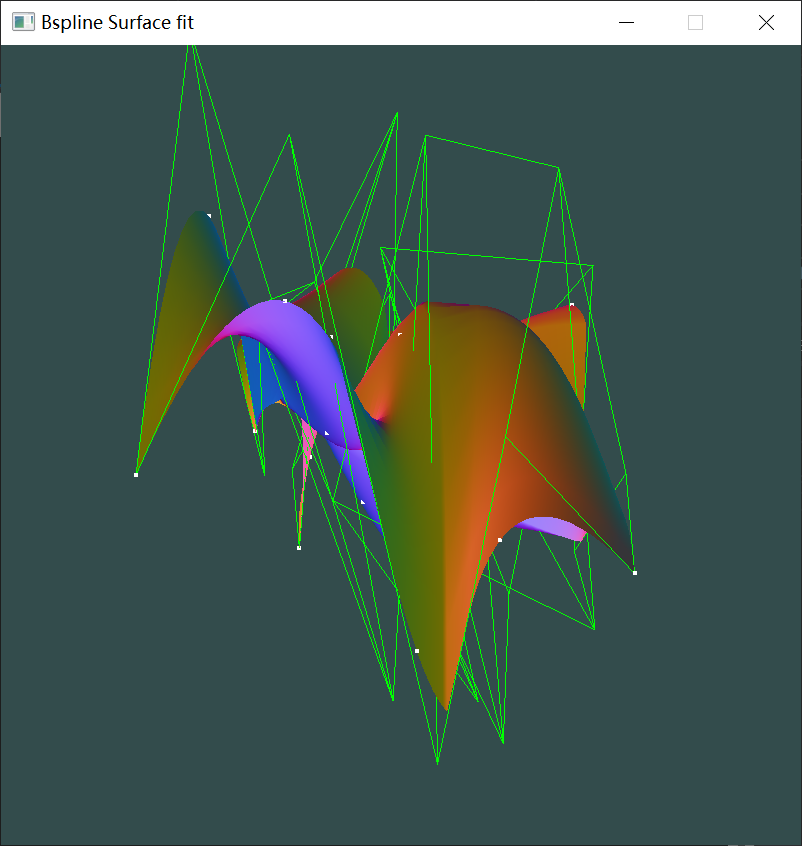
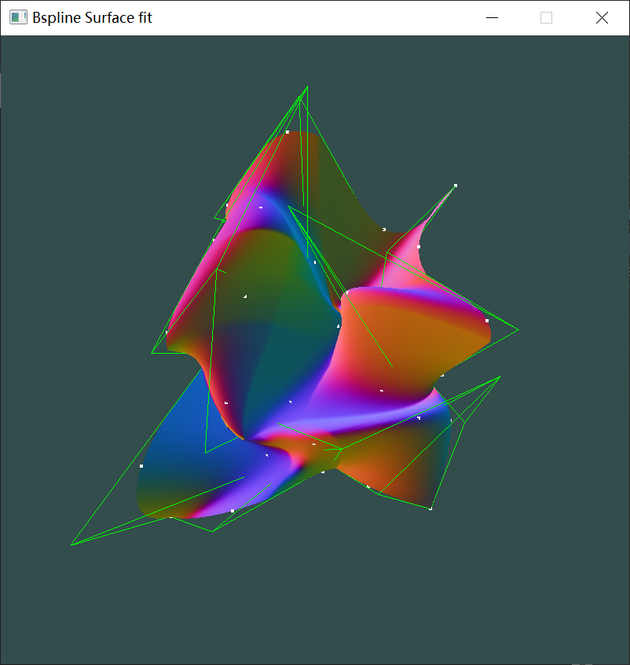
**白色是数据点，绿色的控制点网格，可以发现所有白点都在曲面上。插值正确**

参数生成方式=chordlength
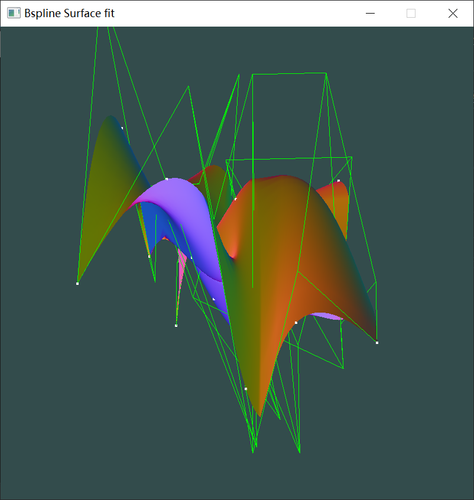
在该数据下，整体形状差不多，有点细微差别。

参数生成方式=centripetal 0.5
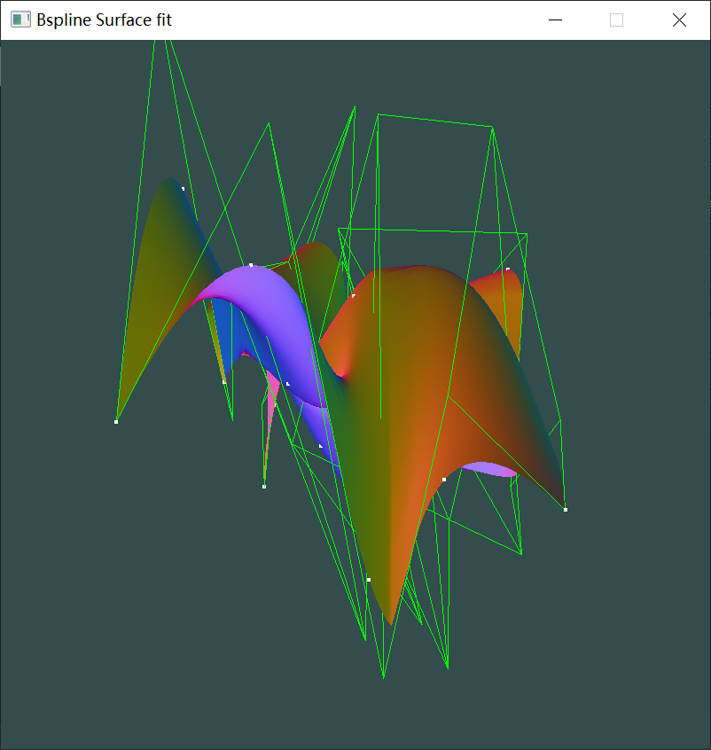
也差不多，有点细微差别。

参数生成方式=universal
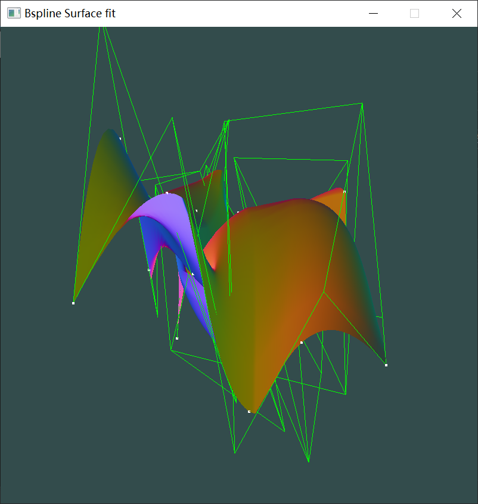
和前三种的差别比较多大，有一个峰扁平了很多。

参数生成方式=uniform，节点向量生成方式=uniform
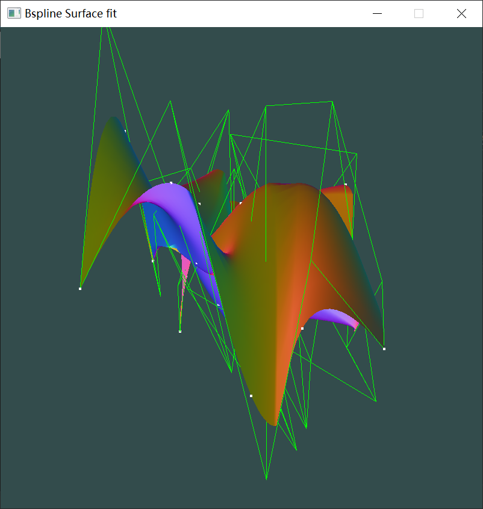
和uniform的节点生成方式也差不太多。

`p=3,q=3`参数生成方式=uniform，节点向量生成方式=average

形状差异比较大，控制点网格也曲折了很多。
### 拟合测试
`p=2 q=2 m=3 n=4`,参数生成方式=uniform,节点向量生成方式=average
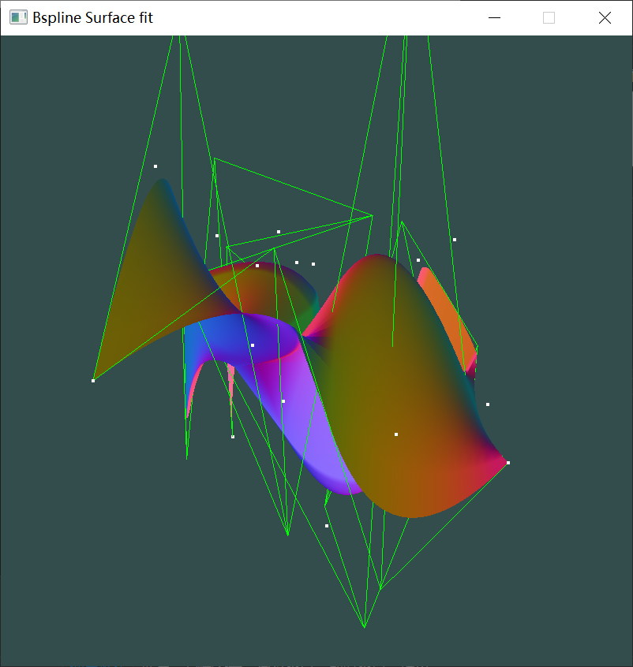
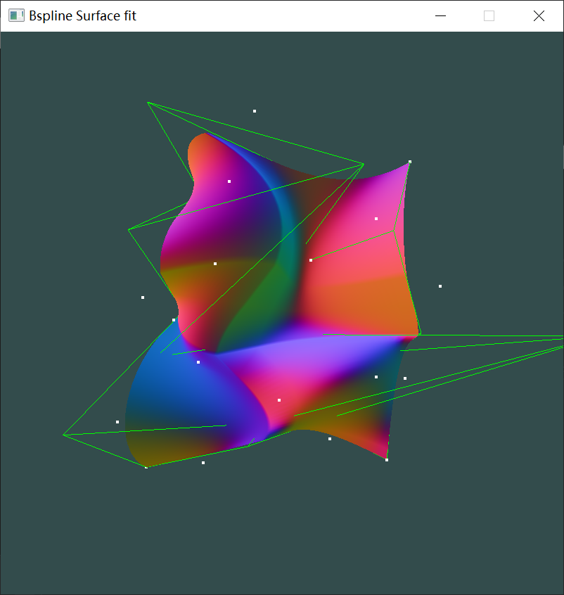
发现很多数据点不在曲面上，因为拟合的控制点网格只有4*5，拟合只能降低误差。

参数生成方式=chordlength

在该数据下，整体形状差不多，有点细微差别。

参数生成方式=centripetal 0.5
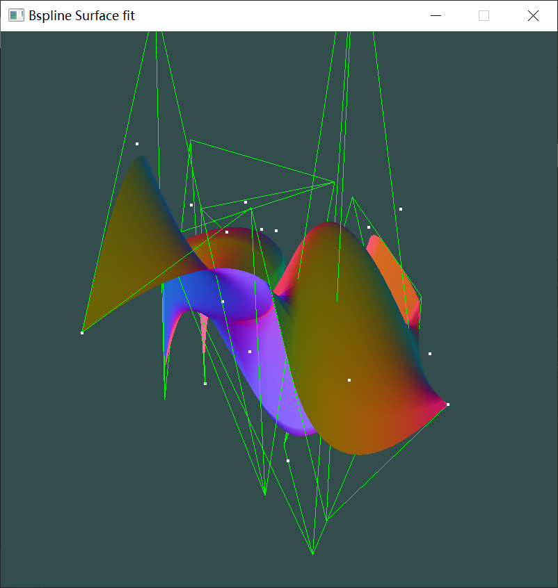
差别不是很大

参数生成方式=uniform, 节点生成方式=uniform
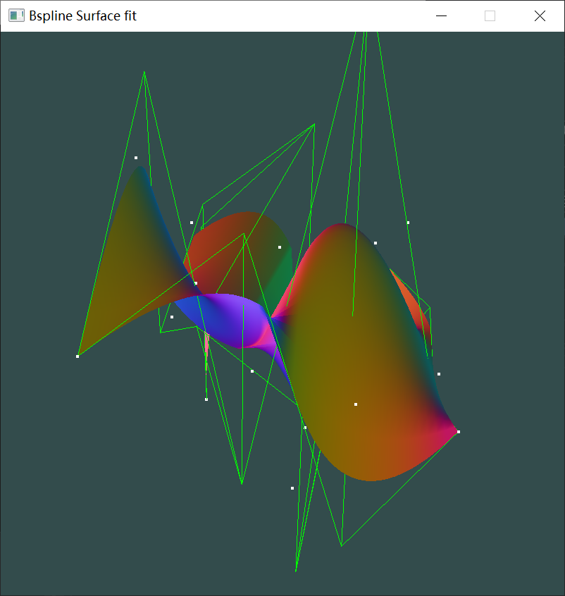
差别也不是很大

`p=3 q=3 m=3 n=4`,参数生成方式=uniform,节点向量生成方式=average
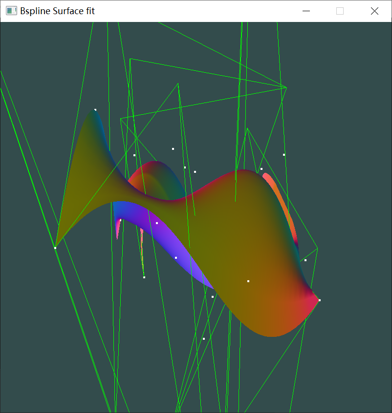
差别比较大，感觉整体顺滑了一点。

`p=2 q=2 m=3 n=3`,参数生成方式=uniform,节点向量生成方式=average
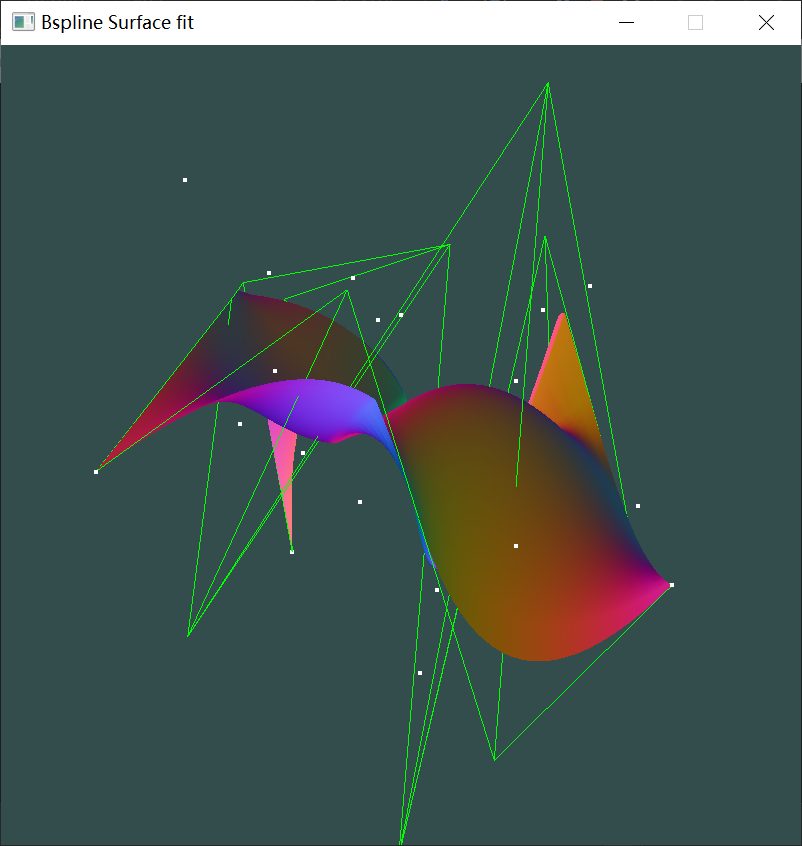
差别比较大，距离比较大的离群点变多。
## 课件上的公式有问题
拟合部分有很多h和n混乱，阅读材料`Fit and Interpolation.pdf`也存在这个问题。如下图
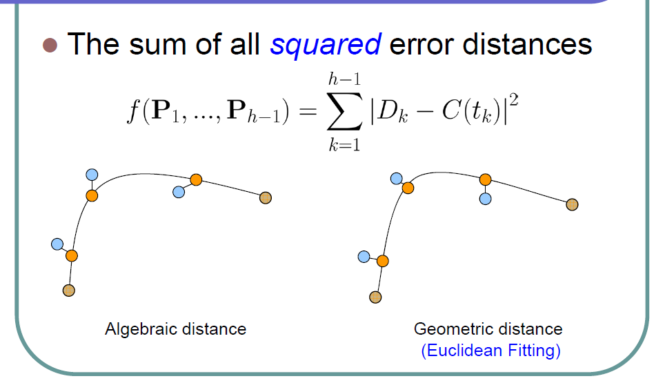
一共有n个点，所以应该优化n个点的误差之和。之后的推导中也有这个问题，但是结论的公式是没错的。